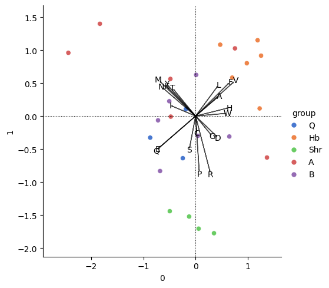
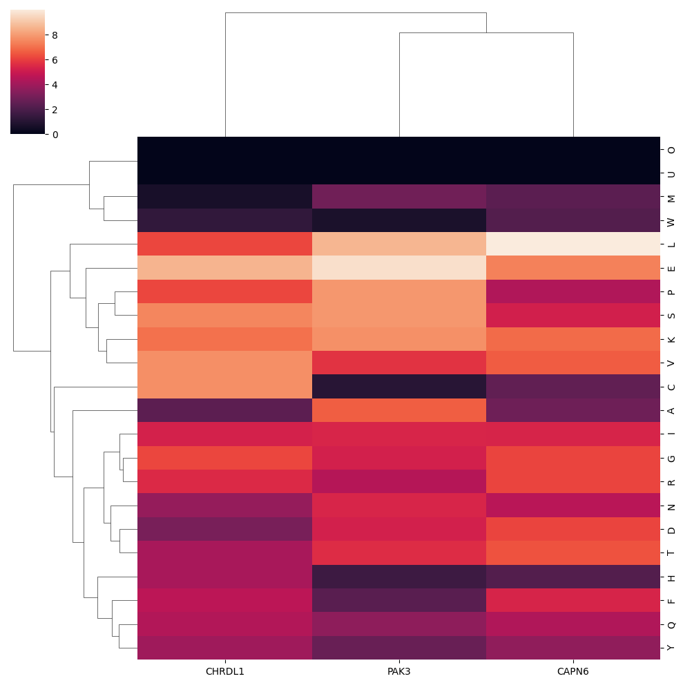
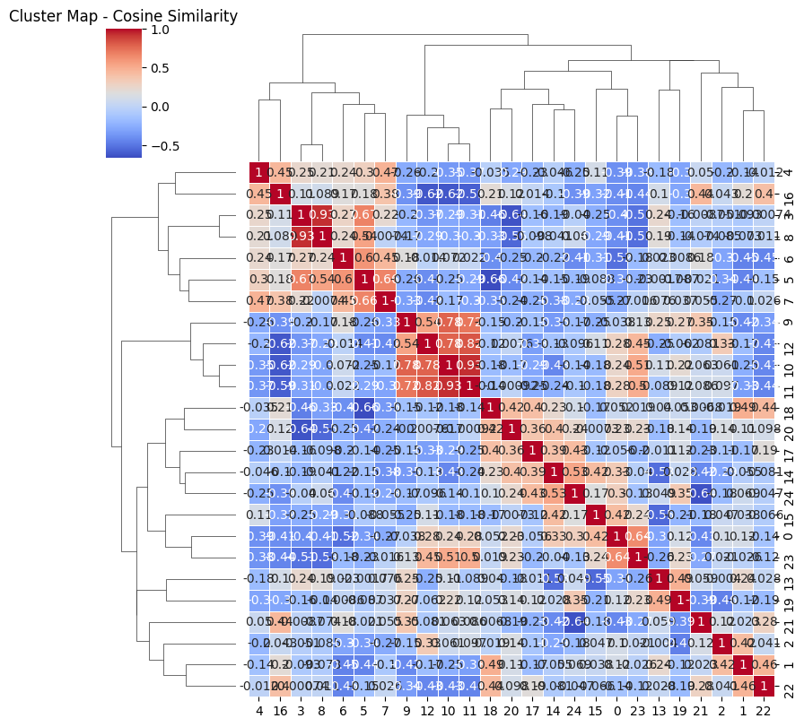
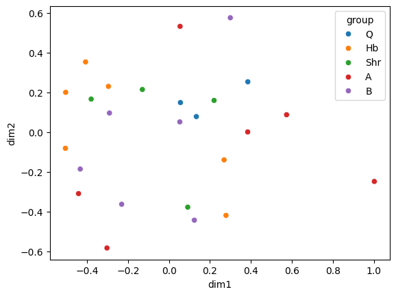

# Protein Sequence Analysis Project

December 2023

This project analyzes protein sequences and their relationships through amino acid composition analysis, focusing on PAK3 and its neighboring proteins CAPN6 and CHRDL1. The analysis includes sequence comparisons, feature engineering, and dimensionality reduction techniques to understand protein similarities and relationships.


## Installation

Required packages:
- pandas
- numpy
- seaborn
- matplotlib
- scikit-learn
- statsmodels

## Key Features
1. Protein sequence analysis
2. Amino acid composition calculation
3. Feature engineering
4. Principal Component Analysis (PCA)
5. Distance matrix calculations
6. Visualization of protein relationships

## Analysis Steps
1. Sequence Processing
   - Loading protein sequences
   - Calculating amino acid compositions
   - Feature engineering

2. Comparative Analysis
   - Correlation analysis
   - Euclidean distance calculations
   - Cosine similarity measurements

3. Dimensionality Reduction
   - PCA analysis
   - Non-metric multidimensional scaling

## Results
Key findings include:
- PAK3 shows similarity to pure alpha and hemoglobin proteins
- Feature engineering successfully normalized the protein characteristics
- PCA analysis revealed distinct clustering patterns among protein families

## Visualization Examples
# Key Visualizations

## Principal Component Analysis (PCA) Biplot


Shows how different amino acids contribute to protein differentiation, revealing that our focal proteins show similarities to pure alpha and hemoglobin protein families.

## Amino Acid Composition Cluster Heatmap


Shows the relative abundance of each amino acid across our three focal proteins (PAK3, CAPN6, and CHRDL1), highlighting distinct compositional patterns that characterize each protein.

## Cosine Similarity Clustering


Reveals relationship patterns between proteins based on their amino acid composition, providing insights into protein family groupings and evolutionary relationships.

## Euclidean Distance Matrix


Quantifies the absolute differences between protein compositions, offering a complementary view to the cosine similarity analysis for understanding protein relationships.

## Usage
Example usage of the main analysis functions:
```python
from src.sequence_analysis import calculate_aa_composition
from src.feature_engineering import engineer_features

# Calculate amino acid composition
aa_comp = calculate_aa_composition(sequence)

# Engineer features
engineered_features = engineer_features(aa_comp)
```
